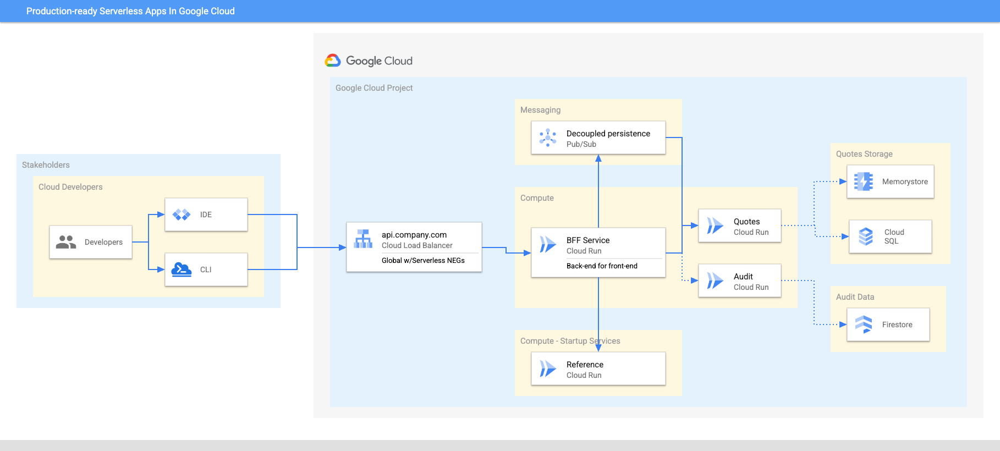

# Building sample services for Serverless Production Readiness and Optimization for Java in Google Cloud 
All services are documented and can be built from a single script in this folder or individually as per each service listed below

### Build a JVM and Native Java application image
```
./mvnw package 
./mvnw native:compile -Pnative -DskipTests
```

### Build a JIT and Native Java Docker Image with Buildpacks
```
./mvnw spring-boot:build-image -Pjit
./mvnw spring-boot:build-image -Pnative -DskipTests
```
Building each service individually or as part of the entire architecture
* [Quotes](quotes/README.md) Service - manage quotes from famous books, persisted in CloudSQL (Postgres)
* [Audit](audit/README.md) Service - audit updates (persisted in Firestore)
* [Reference](reference/README.md) Service - invoked by BFF service at start-up, to read reference data
* [Faulty](faulty/README.md) Service - illustrate a faulty service for resiliency purposes
* [BFF](bff/README.md) Service - Backend-for-frontend service for downstream services



